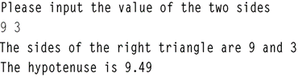
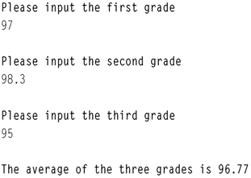
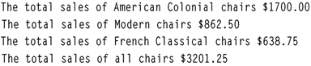
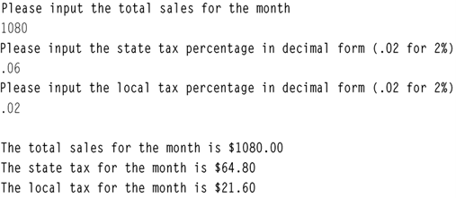

# C++ For Science - Lab 3

This template repository is the starter project for C++ For Science Lab 2. Written in C++.

### Question(s)

1. **Working with the cin Statement**

Bring in the program bill.cpp from the Lab 3 folder. The code of bill.cpp is as listed below:

  

1.1. Complete the program so that a sample run inputting 22 for the number of items bought and 10.98 for the price of each item will produce the results below.

Sample run of the program.

  

  

1.2. Once you have the program working, change the instruction:

```cout << setprecision(2) << fixed << showpoint;```

to

```cout << setprecision(2) << showpoint;```

Rerun the program with the same data given in Exercise 1 above and record your results. What do you think the fixed attribute in the cout statement does?

1.3. Now put the fixed attribute back in and change the instruction to make the precision 4. Rerun the program with the same data given in Exercise 1 and record your results. What do you think the setprecision() attribute in the cout statement does?

The attribute showpoint forces all floating point output to show a decimal point even if the values are whole numbers. In some environments this is done automatically.

1.4. Add the following directive to the program: ```#include <string>``` in the header. Alter the program so that the program first asks for the name of the product (which can be read into a string object) so that the following sample run of the program will appear.

  

Now alter the program, if you have not already done so, so that the name of an item could include a space within its string.

  

2. **Formatting Output**

Look at the following table:

  

Assume that from the left margin, the price takes up fifteen spaces. We could say that the numbers are right justified in a 15-width space. Starting where the price ends, the next field (quantity) takes up twelve spaces. We can use the formatted output from Lab 3.1 and the statement setw(n) where n is some integer to indicate the width to produce such tables.

Bring in the program tabledata.cpp from the Lab 3 folder. The code of tabledata.cpp is as follows:

  

2.1. Finish the code above by filling in the blanks and the instructions necessary to execute the following sample run. Note that two or more data items can be input at one time by having at least one blank space between them before hitting the enter key.

  


3. **Arithmetic Operations and Math Functions**

Bring in the program righttrig.cpp from the Lab 3 folder.

The code of righttrig.cpp is as follows:

  

The formula for finding the hypotenuse is hyp   

How can this be implemented in C++?

Hint:	You will use two pre-defined math functions (one of them twice) learned in this lesson. One of them will be “inside” the other.

3.1. Fill in the missing statement so that the following sample run is implemented:

  

3.2. Alter the program so that the sample run now looks like the following:

  

Note:	This is not a trivial change. You must include another directive as well as use the formatted features discussed in the earlier labs of this lesson. Notice that the change is made only to the value of the hypotenuse and not to the values of 9 and 3.

4. **Working with Type Casting**

Bring in the program batavg.cpp from the Lab 3 folder.

The code of batavg.cpp is as follows:

  

4.1. Run this program and record the results. The batting average is ___________.

4.2. There is a logic error in this program centering around data types. Does changing the data type of batAvg from int to float solve the problem? Make that change and run the program again and record the result.

The batting average is ___________.

4.3. Continue to work with this program until you get the correct result. The correct result should be 0.292162. Do not change the data type of the two named constants. Instead, use a typecast to solve the problem.  

5. **Working with Type Casting**

5.1. Write a program that will read in 3 grades from the keyboard and will print the average (to 2 decimal places) of those grades to the screen. It should include good prompts and labeled output. Use the examples from the earlier labs to help you. You will want to begin with a design. The Lab #1 Pre-lab Reading Assignment gave an introduction for a design similar to this problem. Notice in the sample run that the answer is stored in fixed point notation with two decimal points of precision.

Sample run:

  

5.2. The Woody furniture company sells the following three styles of chairs:

```
Style	            Price Per Chair

American Colonial	$ 85.00 
Modern	            $ 57.50
French Classical	$127.75
```

Write a program that will input the number of chairs sold for each style. It will print the total dollar sales of each style as well as the total sales of all chairs in fixed point notation with two decimal places.

Sample run:

  

  


5.3. Write a program that will input total sales (sales plus tax) that a business generates for a particular month. The program will also input the state and local sales tax percentage. It will output the total sales plus the state tax and local tax to be paid. The output should be in fixed notation with 2 decimal places.  

Sample run:  

  
